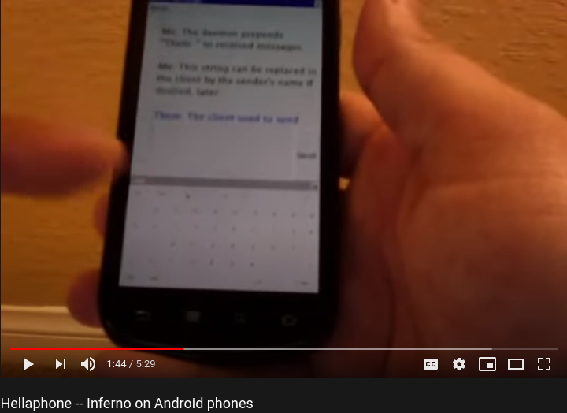
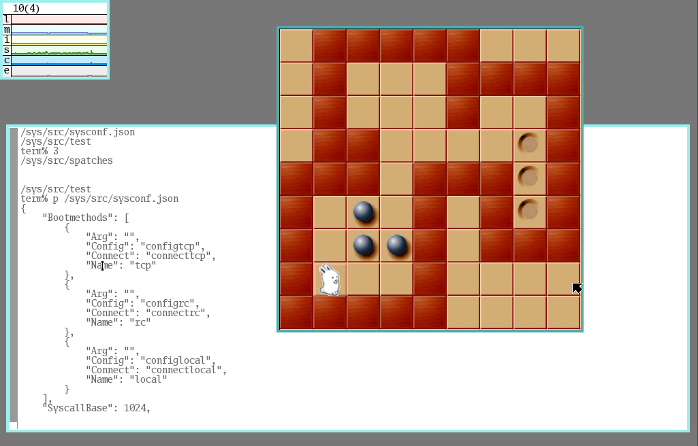

## Agenda

- Introduction
- Plan 9
- Harvey
- u-root

# Introduction

## Hello, I am Daniel :-)

:::::::::::::: {.columns}
::: {.column width="42%"}
{ width=100% }
:::
::: {.column width="58%"}
### Work and education
- IT security and computer science
- software engineer
- infrastructure and web
- applications and UI

### Open Source contributions
- hardware and firmware
- operating systems
- software distributions
- reverse engineering
:::
::::::::::::::

# Plan 9

## Plan 9 from Bell Labs

Plan 9 is a [distributed operating system](
https://en.wikipedia.org/wiki/Distributed_operating_system).

- developed by the Unix people
- under a free license since 2002

It brought us Unicode, the 9P protocol, and innovation in user interfaces.

wmii, on which the popular i3 window manager is based, stems from Plan 9 ideas.


[https://docs.huihoo.com/plan9/Plan9.pdf
](https://docs.huihoo.com/plan9/Plan9.pdf)

[http://dlc.casita.net/~dlc/vp9cb/04_P9Server.utf8.html
](http://dlc.casita.net/~dlc/vp9cb/04_P9Server.utf8.html)

## Forks and derivatives

- [9atom](http://www.9atom.org/)
- [9front](http://www.9front.org/)
- [9legacy](http://9legacy.org/)

http://man.postnix.pw/9atom/3/intro

https://comp.os.plan9.narkive.com/t9PiG7a0/9atom-vs-9front

[Plan 9 README](http://mirtchovski.com/p9/README.html)

[Grid Computing with Plan 9](http://mirtchovski.com/p9/thesis.pdf)

[Why Some Dead OSes Still Matter](
https://www.usenix.org/system/files/login/articles/546-mirtchovski.pdf)

[Systems Software Research is Irrelevant](
http://herpolhode.com/rob/utah2000.pdf)

## Forks and derivatives cont.

- [NIX](http://lsub.org/ls/nix.html)
  * partioned many-core systems
- [Akaros](http://akaros.cs.berkeley.edu/)
  * research system at Berkeley, user-space VMs, can run Linux
- [Harvey OS](https://harvey-os.org/)
  * started from a NIX kernel and the LSUB release of Plan 9
- [JehanneOS](http://jehanne.io/)
  * uses Harvey's build system
- [Inferno](http://www.vitanuova.com/inferno/)
  * Limbo programming language

## On a phone

[Hellaphone](http://jfloren.net/b/2015/8/18/2) by Floren et al

- Android replaced by Inferno
[{ width=60% }](https://youtu.be/dF_-jQc53jw)


# Harvey OS

## A distributed operating system

:::::::::::::: {.columns}
::: {.column width="42%"}
{ height=72% }
:::
::: {.column width="58%"}
- 64-bit OS
- based on Plan 9
- suitable for studying and research
- Unix philosophy: simplicity, clarity, modularity and composability
:::
::::::::::::::

[https://harvey-os.org/](https://harvey-os.org/)

## Building

[https://github.com/Harvey-OS/harvey/wiki/Building-Harvey](
https://github.com/Harvey-OS/harvey/wiki/Building-Harvey)

```sh
git clone https://github.com/Harvey-OS/harvey
cd harvey
./bootstrap.sh
CC=clang ARCH=amd64 ./linux_amd64/bin/build
```

## Booting

### [QEMU](https://github.com/Harvey-OS/harvey/wiki/Running-Harvey-on-Qemu)

```sh
HARVEY=$(pwd) ./util/GO9PTERM
```

### Real Hardware :)

https://github.com/Harvey-OS/harvey/wiki/Booting-Harvey-on-real-hardware-II-(USB)#preparing-the-usb-dongle-1

## Impression

:::::::::::::: {.columns}
::: {.column width="92%"}

:::
::: {.column width="8%"}
:::
::::::::::::::

# u-root

## A universal root filesystem

:::::::::::::: {.columns}
::: {.column width="42%"}
{ height=72% }
:::
::: {.column width="58%"}
- many small tools
- all open, meant for studying and understanding
- easily portable
- written in Golang


:::
::::::::::::::

[https://u-root.org/](https://u-root.org/)


## Getting u-root into Harvey

```
commit 88cd7c2dde2810e50e918c009691b5afd33204dc
Author: Ronald G. Minnich <rminnich@gmail.com>
Date:   Wed Sep 2 08:36:21 2020 -0700

    Build in u-root support

    This change builds in u-root support. u-root is no longer
    optional.

    Images will now be larger, but you will get a lot of benefit.

    The build now includes ALL of amd64/bin -- ed, sam,
    rio, acme, -- all of it.
```

patch (excerpt)


# Now what?

## Have a closer look!

{ height=42% }

[https://harvey-os.org/](https://harvey-os.org/)
